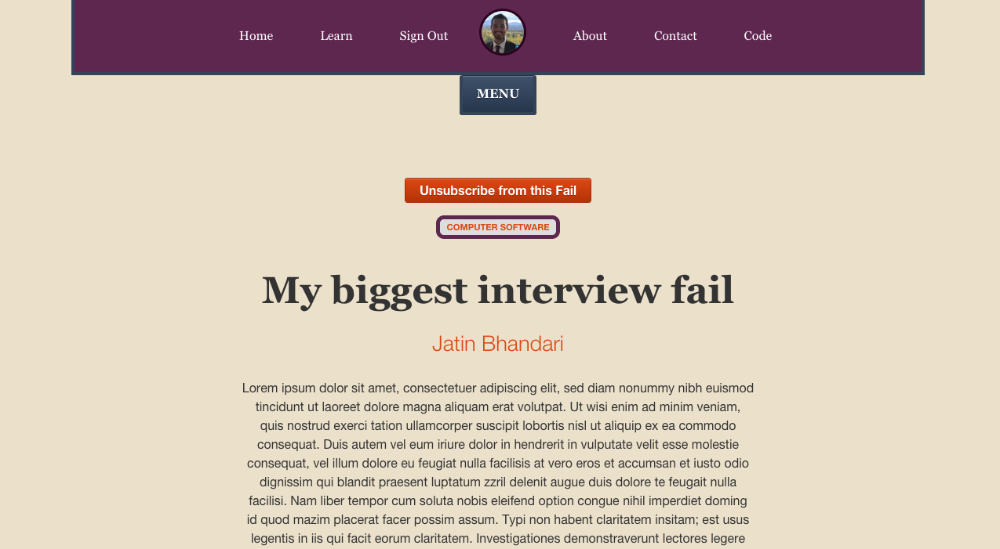
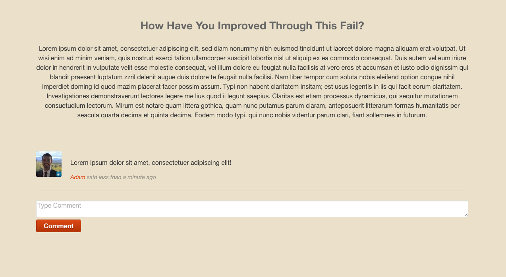

FailForward
===========

Allows users to login via LinkedIn and make posts about failures they have dealt
with in their career field. Users can then update these posts with what they
have learned and how they have improved through this failure. Other users can
can subscribe to and comment on individual posts.

Uses [LinkedIn OAuth](https://developer.linkedin.com/documents/authentication)
for user authentication.
